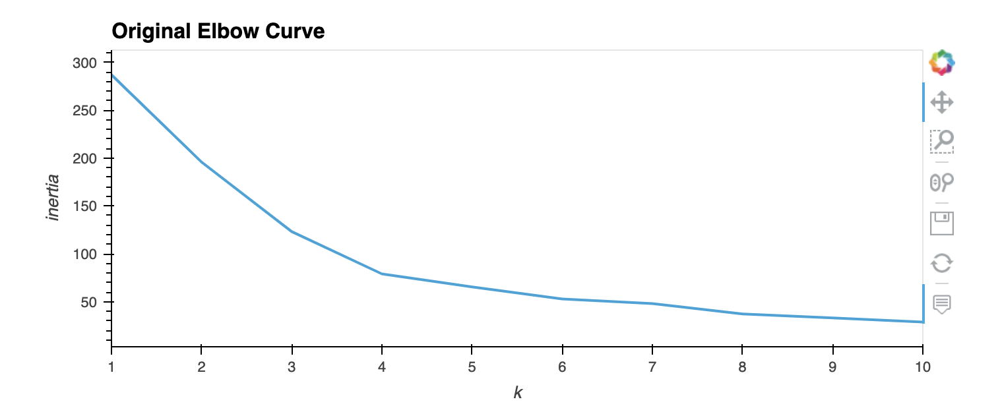
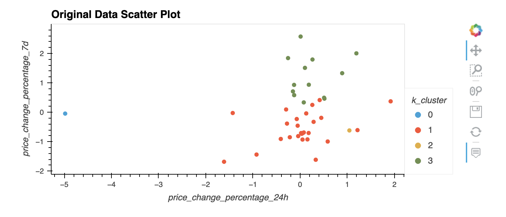
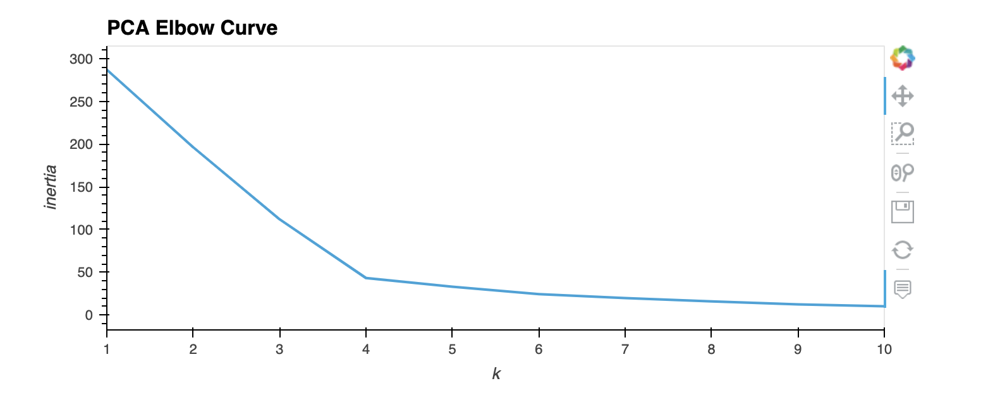
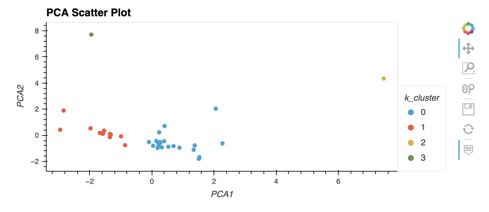

# Cryptocurrency_Clusters_Challenge

The purpose of this challenge was to use unsupervised machine learning in order to cluster cryptocurrencies based on their price change over various time periods, using the scikit-learn python library. The data was scaled, and the clusters were represented visually using a scatter plot. Additionally, a principal component analysis (PCA) was performed in order to optimize the clusters, and a second scatter plot was created to compare the original scaled data to the PCA data. 

Installation Guide

Please install the following libraries:
```python
pip install -U scikit-learn
conda install -c pyviz hvplot
```

The following plots show the results of the analysis performed on the data in the crypto_market_data.csv file, located in the Resources folder:








